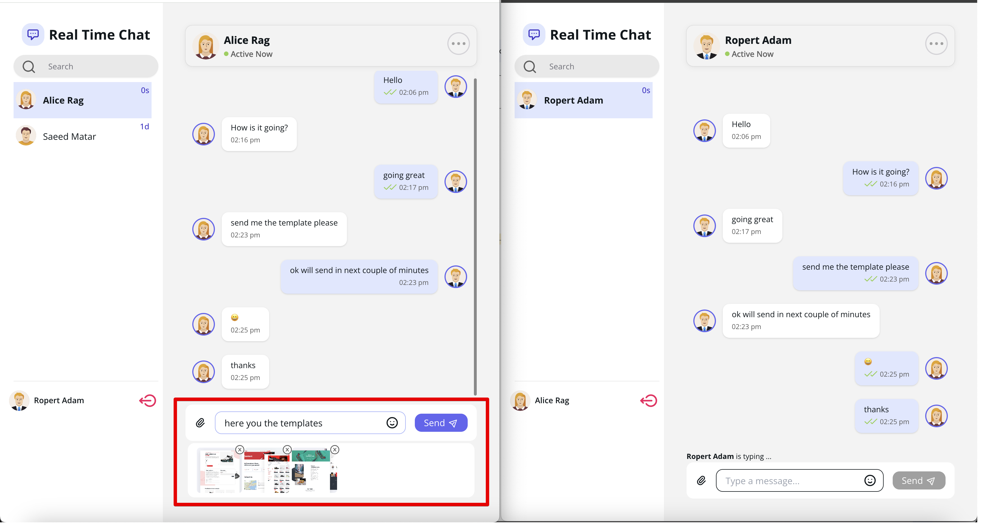
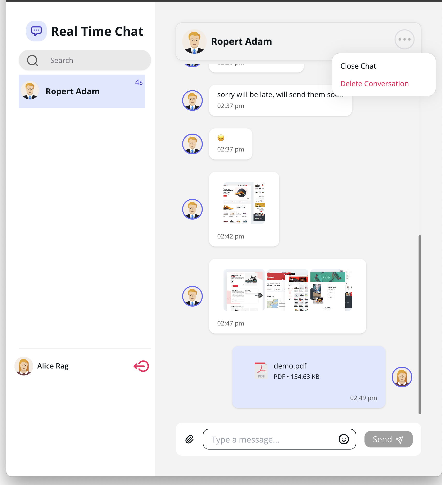
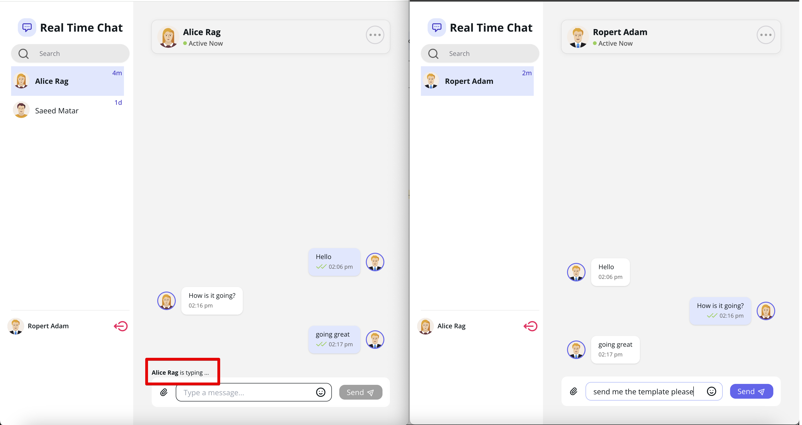
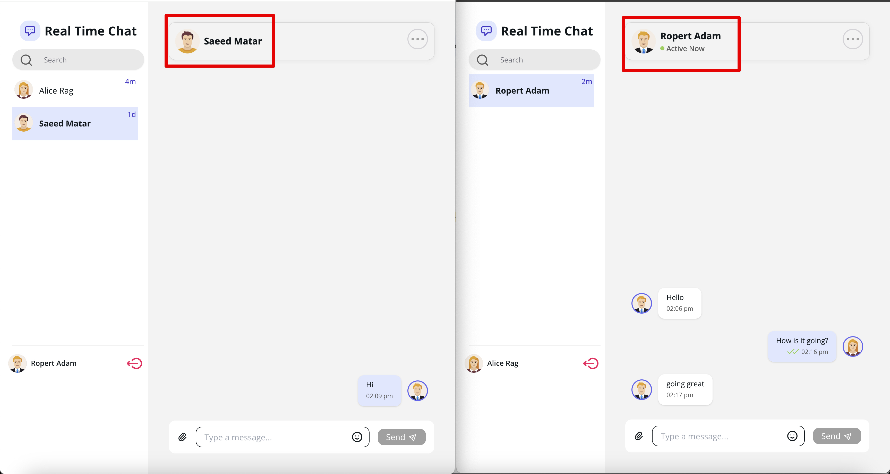
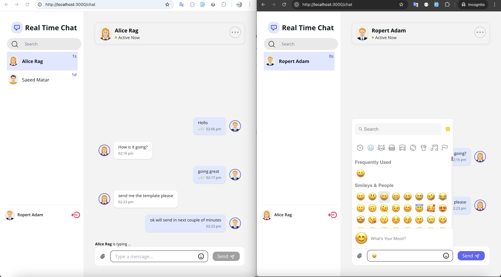
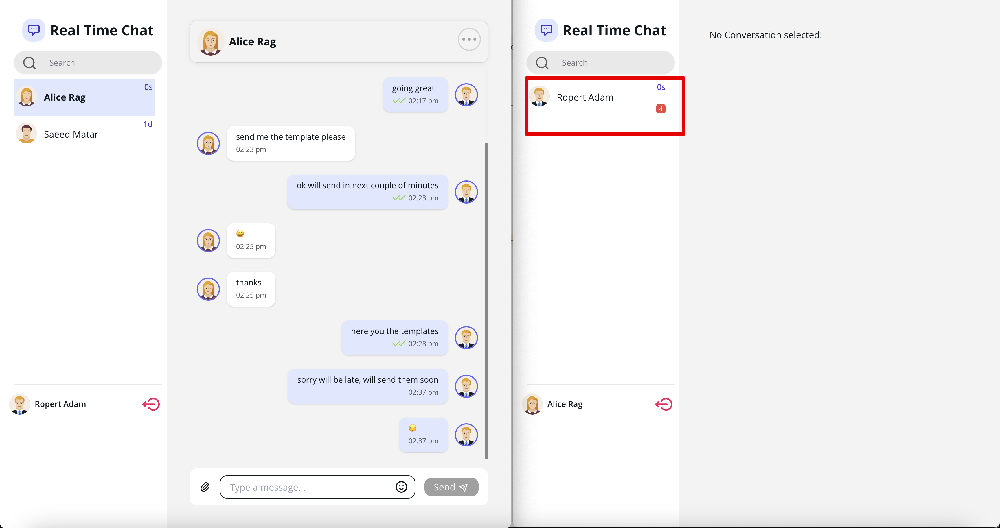

# Real-Time Chat Application

This project is a real-time chat application built with React, Next.js, Reverb, and Laraship. The application leverages Laraship as the backend, Reverb for real-time capabilities, and Next.js as the frontend framework. Media files are stored securely using Amazon S3.

### Elevate Your Projects with Our Expert Laravel Team!
Are you seeking a dedicated, experienced Laravel development team to bring your web projects to life? Look no further than Corals. Our team of seasoned Laravel developers is here to collaborate with you and deliver top-notch, customized solutions that exceed your expectations.

Ready to take your project to the next level with our expert Laravel team? Reach out to us at info@corals.io or fill out the [form on our website](https://www.laraship.com/contact/) to discuss your project requirements and kickstart a successful collaboration.

## Table of Contents

- [Features](#features)
- [Installation](#installation)
- [Usage](#usage)
- [Contributing](#contributing)
- [Screenshots](#screenshots)
- [License](#license)

## Features

- **Real-time messaging:** Instant message delivery and receipt across all connected clients.
- **Multiple attachments:** Send images, documents, videos, and other file types stored securely on S3.
- **Typing indicators:** See when another user is typing a message.
- **Read Messages Indicator:** double <span style="color:green;">&check;&check;</span> when the message read.
- **Emojis:** Integrate emojis into your messages for expressive communication.
- **Conversation search:** Easily search through conversations to find specific messages.
- **Delete messages:** Remove unwanted messages from conversations with delete functionality.
- **User authentication:** Secure user login and registration powered by Laraship.
- **Scalable architecture:** Designed to scale with your application's growth.
- **Mobile responsive design:** Fully functional on both desktop and mobile devices.
- **Easy to extend and customize:** Modular design for adding new features and customizations.

## Installation

### Prerequisites

- [Node.js](https://nodejs.org/) (>= 18.x)
- [Composer](https://getcomposer.org/) (for Laraship)
- [PHP](https://www.php.net/) (>= 8.2)
- [Laraship](https://www.laraship.com/) (>= 10.x)
- [MySQL](https://www.mysql.com/) or another supported database
- [Amazon S3](https://aws.amazon.com/s3/) for media storage

### Backend (Laraship)

1. Clone the repository:
    ```bash
    git clone https://github.com/coralsio/laraship.git
    cd laraship
    ```

2. Install dependencies:
    ```bash
    composer install
    ```

3. Set up your environment file:
    ```bash
    cp .env.example .env
    php artisan key:generate
    ```

4. Configure your database and S3 settings in the `.env` file:
    ```env
    DB_CONNECTION=
    DB_HOST=
    DB_PORT=
    DB_DATABASE=
    DB_USERNAME=
    DB_PASSWORD=

    AWS_KEY=
    AWS_SECRET=
    AWS_REGION=
    AWS_BUCKET=


    REVERB_APP_ID=your-reverb-app-id
    REVERB_APP_KEY=your-reverb-app-key
    REVERB_HOST=your-reverb-host
    REVERB_PORT=8080
    REVERB_SCHEME=http

    ```

5. Run migrations:
    ```bash
    php artisan migrate
    ```

6. Install Laraship Messaging Module
    ```bash
   composer require corals/messaging
    ```
  Next, install the Messaging module from the /modules section in the laraship admin panel.
 
 check corals messaging module features https://github.com/coralsio/messaging
6. Install and Start Reverb
    ```bash
   php artisan reverb:install
   php artisan reverb:start 
    ```


### Frontend (React & Next.js)

1. clone the frontend repository
    ```bash
    git clone https://github.com/coralsio/real-time-chat.git
    cd real-time-chat
    ```

2. Install dependencies:
    ```bash
    npm install
    ```

3. Update .env file for the following
   ```
    NEXT_PUBLIC_REVERB_APP_ID=your-reverb-app-id
    NEXT_PUBLIC_REVERB_APP_KEY=your-reverb-app-key
    NEXT_PUBLIC_REVERB_HOST=your-reverb-host    
    NEXT_PUBLIC_REVERB_PORT=8080
    NEXT_PUBLIC_REVERB_SCHEME=http
    NEXT_IMAGE_DOMAINS=your-laraship-domain,your-aws-bucket-dowmin ,  specify the allowed image domains. To include
multiple domains, separate them with commas.

5. Start the Next.js development server:
    ```bash
    npm run dev
    ```

## Usage

### Running the Application

- **Start the Laraship Backend:**
    ```bash
    php artisan serve
    ```

- **Start the React/Next.js Frontend:**
    ```bash
    npm run dev
    ```

- **Open your browser and navigate to:**
    ```
    http://localhost:3000
    ```

### Sending Messages

- Log in or register a new account.
- Navigate to the chat page.
- Start a new conversation or join an existing one.
- Send a message and see it appear in real-time for all participants.

### Additional Features

- **Multiple Attachments:** Click on the attachment icon to upload and send multiple files like images, documents, and videos. All media files are stored securely on Amazon S3.
- **Is Typing Functionality:** A "User is typing..." indicator will appear when another user is typing a message in the conversation.
- **Emojis:** Click on the emoji icon to browse and insert emojis into your messages.
- **Conversation Search:** Use the search bar within the chat interface to search through your conversation history.
- **Delete Messages:** Hover over a message and click the delete icon to remove it from the conversation.

## Contributing

Contributions are welcome! Please feel free to submit a Pull Request or open an Issue to discuss any changes.

## Screenshots








## License

This project is licensed under the MIT License - see the [LICENSE](LICENSE) file for details.
